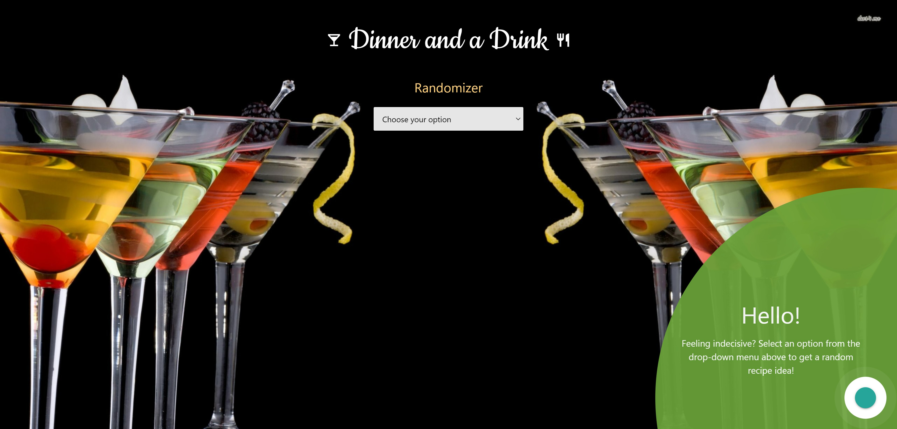

# Dinner and Drink Decision Maker

[Link to finished website](https://ashbylb.github.io/dinner-drink-decisions/)

## Table of Contents
- [Description](#Description)
- [Screenshots](#Screenshots)
- [Usage](#Usage)
- [Language](#language)
- [License](#License)
- [Contact](#Contact)

## Description
This website is created to help indecisive individuals pick out a random meal or drink. When the page is opened they are presented with a drop down menu. After the user selects either the dinner or drink option, a random recipe with picture is shown on the webpage. They can quickly search for a new item by using the drop down menu.

## Screenshots

## Usage
To help people make decisions on what to eat or drink.

## Language
HTML, CSS, and Javascript

## License 
MIT

## Contact
Ashby Blakely ashbyleeblakely@gmail.com, Laura Weiner laurarweiner@gmail.com, Kenneth Jackson  K.a.jack21@gmail.com.